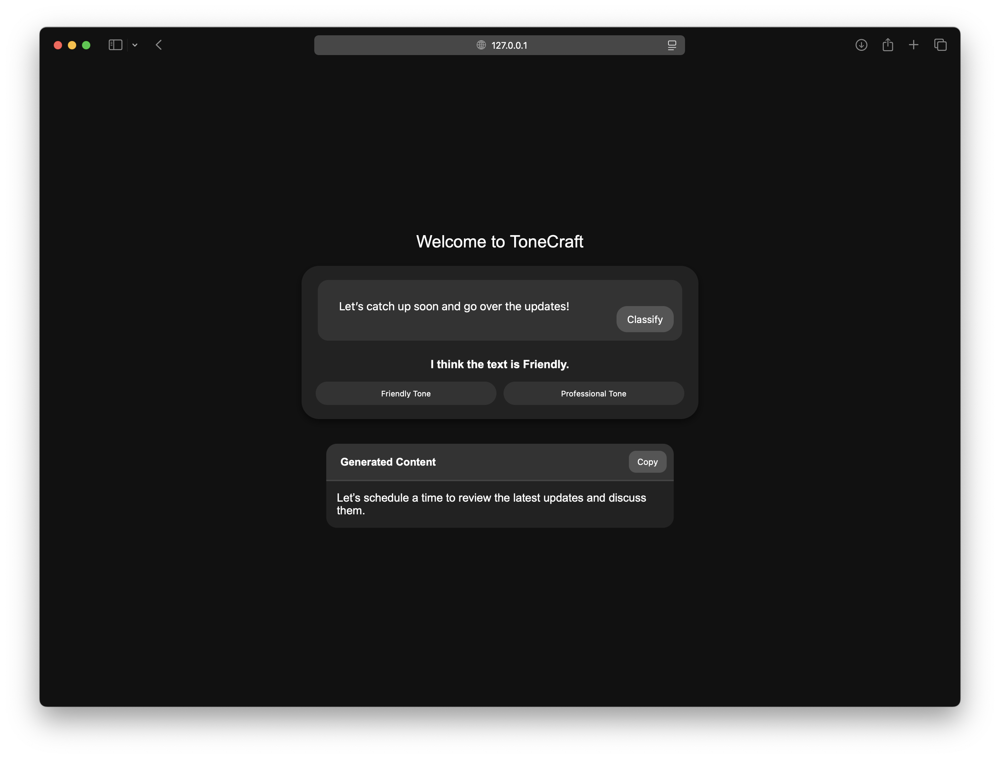
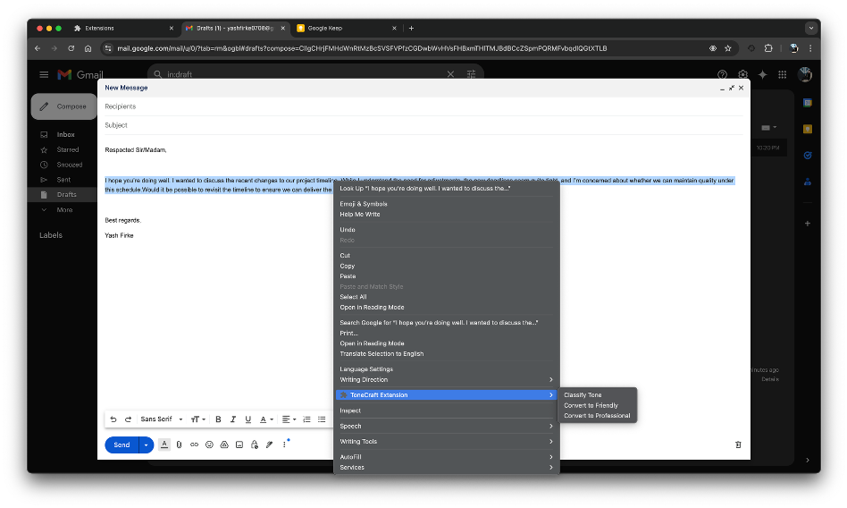
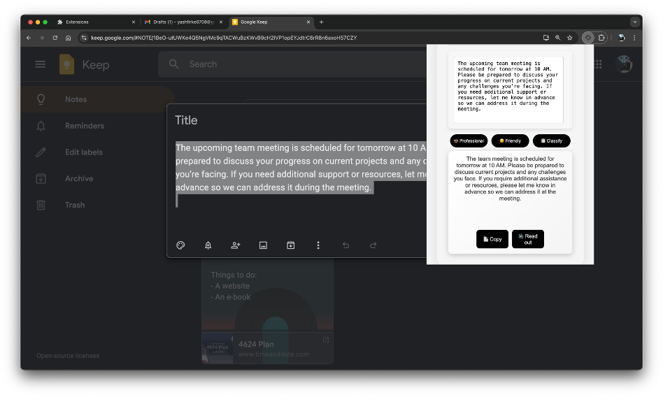

# ToneCraft
ToneCraft is a comprehensive machine learning application designed to transform text tones. By fine-tuning models like BERT for tone classification and Flan-T5 for text generation, ToneCraft allows users to adjust and refine text between professional and friendly tones with ease.

## Features
- **Tone Classification**: Classifies input text tone as professional or friendly using a fine-tuned BERT model.
- **Tone Transformation**: Transforms text to the user-specified tone with a Flan-T5-based model trained for text generation and stylistic adjustments.
- **User Input Logging**: Records tone selection and usage data to improve future interactions.
- **API Integration**: A scalable API layer to handle text processing requests.

## Take a Peek
#### Website

#### Right-click shortcut

#### Extension Menu

## License
This project is licensed under the **ToneCraft Proprietary License**. By using this software, you agree to the terms and conditions outlined in the LICENSE file. This license grants you limited, non-commercial use rights; modification, distribution, or commercial use is strictly prohibited without permission from Yash Firke.

For more details, please refer to the [LICENSE](./LICENSE.md) file.

---

Developed by **Yash Firke**.
